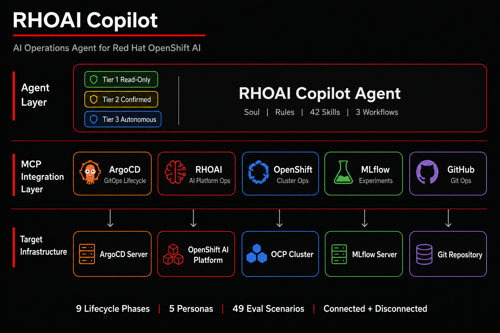
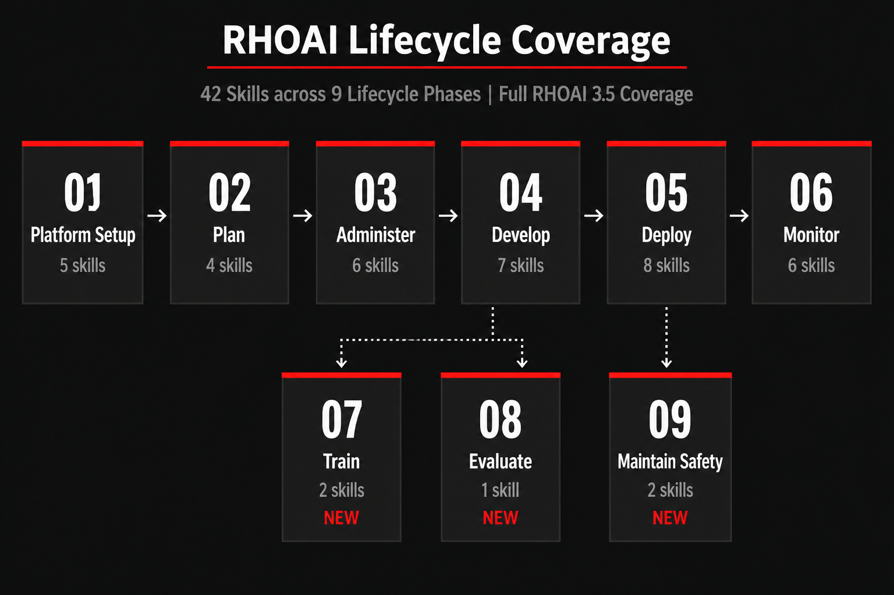
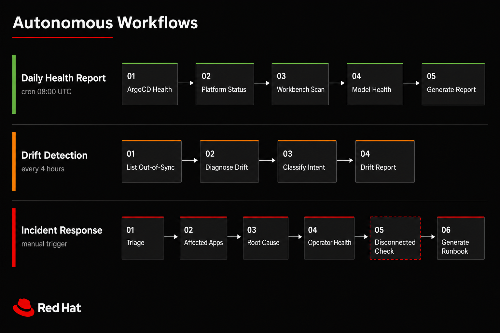

<p align="center">
  
</p>

<p align="center">
  <strong>AI Operations Agent for Red Hat OpenShift AI</strong><br/>
  Deploy, configure, manage, and operate RHOAI via GitOps — connected and air-gapped.
</p>

<p align="center">
  <a href="docs/getting-started/quickstart.md">Quick Start</a> ·
  <a href="docs/getting-started/deployment-guide.md">Deployment Guide</a> ·
  <a href="docs/reference/compatibility-matrix.md">Compatibility</a> ·
  <a href="CONTRIBUTING.md">Contributing</a>
</p>

<p align="center">
  <a href="LICENSE"></a>
  <a href="skills/"></a>
  <a href="eval/"></a>
  <a href="mcp-servers/"></a>
  <a href="docs/reference/compatibility-matrix.md"></a>
  <a href="docs/reference/compatibility-matrix.md"></a>
</p>

---

RHOAI Copilot is an AI agent that manages the full lifecycle of **Red Hat OpenShift AI** through 5 MCP (Model Context Protocol) servers. It handles everything from initial platform deployment through day-2 operations, model serving, and safety governance — all via GitOps. Built for both connected and **disconnected (air-gapped)** environments.

---

## Get Started in 3 Steps

```bash
# 1. Clone and configure
git clone https://github.com/rrbanda/rhoai-copilot.git && cd rhoai-copilot
oc create secret generic rhoai-copilot-secrets -n rhoai-copilot \
  --from-literal=gemini-api-key=YOUR_KEY \
  --from-literal=argocd-api-token=YOUR_TOKEN \
  --from-literal=dashboard-password=YOUR_PASSWORD

# 2. Deploy (or use pre-built image: ghcr.io/rrbanda/rhoai-copilot:latest)
make deploy

# 3. Validate
./scripts/validate-deployment.sh
```

> [!TIP]
> See the [Full Deployment Guide](docs/getting-started/deployment-guide.md) for the complete walkthrough with all 5 MCP servers, or [Disconnected Agent Setup](docs/guides/disconnected-setup.md) for deploying the agent on air-gapped clusters.

> [!NOTE]
> **Want to deploy RHOAI itself?** Once the agent is running, ask it: _"Deploy RHOAI on my disconnected cluster"_ or _"Deploy RHOAI 3.5 on my connected cluster."_ The agent has battle-tested deployment skills for both connected and air-gapped environments. See the [deployment templates](manifests/disconnected/) for the underlying manifests.

---

## Why RHOAI Copilot

- **42 skills across 9 lifecycle phases** — from platform setup through model safety, covering the entire RHOAI 3.5 surface
- **5 MCP server integrations** — ArgoCD, RHOAI, OpenShift, MLflow, and GitHub in a unified interface
- **GitOps-native** — all configuration changes flow through Git PRs, never direct cluster mutations
- **3-tier safety model** — read-only by default, confirmed writes for Tier 2, pre-approved scope for autonomous ops
- **Disconnected-first** — air-gapped environments are a primary design constraint, not an afterthought
- **44 eval scenarios** — 100% skill coverage with adversarial safety tests, automated runner, and CI integration

---

## What It Looks Like

```
You:    Deploy RHOAI 2.19 on my disconnected cluster.
        Internal registry is registry.lab.internal:5000.

Agent:  I'll guide you through the full disconnected deployment.

        1. First, let me check your current cluster state...
           [calls: list_applications, cluster_summary]

        2. Here's your ImageSetConfiguration for oc-mirror:
           [generates YAML for registry.lab.internal:5000]

        3. After mirroring, apply this Kustomize overlay:
           [generates disconnected overlay patches]

        Shall I create a PR with these changes to your GitOps repo?
```

---

## Lifecycle Coverage

<p align="center">
  
</p>

| Phase | Count | Skills |
|-------|:-----:|--------|
| **Platform Setup** | 5 | Connected + disconnected deploy (CLI/Console/GitOps), install validator, GitOps config generator |
| **Plan** | 4 | Capacity forecaster, serving runtime advisor, training planner, model catalog |
| **Administer** | 6 | DSC inspector, platform status, upgrades, Kueue quotas, hardware profiles, Feature Store |
| **Develop** | 7 | Workbenches, pipelines, experiments, model registry, OGX/RAG, AutoRAG, GenAI Playground |
| **Train** | 2 | Distributed training (Ray/PyTorch), AutoML |
| **Evaluate** | 1 | LM-Eval benchmarks via EvalHub |
| **Deploy** | 8 | MaaS, llm-d, KServe, model promotion, subscriptions, external models |
| **Monitor** | 6 | ArgoCD health, drift, daily reports, incidents, MaaS debug, model drift |
| **Maintain Safety** | 2 | NeMo Guardrails, Garak vulnerability scanning |

---

## MCP Servers

The agent connects to external systems through 5 Model Context Protocol servers:

| Server | Transport | What It Provides |
|--------|-----------|-----------------|
| **ArgoCD** | stdio | GitOps lifecycle — sync, health, drift, resource trees |
| **RHOAI** | HTTP | AI platform ops — projects, models, workbenches, pipelines, training |
| **OpenShift** | HTTP | Cluster operations — pods, nodes, events, namespaces |
| **MLflow** | HTTP | Experiment tracking — runs, metrics, model registry |
| **GitHub** | stdio | Git operations — PRs, branches, file content |

---

## Safety Model

The agent operates under a strict 3-tier autonomy model defined in [`agent/rules.md`](agent/rules.md):

| Tier | Mode | Examples | Confirmation |
|:----:|------|---------|:------------:|
| 1 | Read-Only | Health checks, reports, diagnostics | None |
| 2 | Controlled Writes | ArgoCD sync (dry-run first), workbench creation, PRs | Required |
| 3 | Autonomous | Scheduled health reports, drift alerts | Pre-approved |

> [!IMPORTANT]
> **Hard constraints (never violated):** No deletes. No writes in `redhat-ods-*` or `openshift-*` namespaces. No direct cluster mutations (GitOps only). No credential exposure. No self-approval of Tier 2 operations.

---

## Built for 5 Personas

| Persona | Focus | Top Skills |
|---------|-------|-----------|
| **AI Engineer** | MaaS, RAG, model serving | `maas-deploy-model` `llmd-deployment-manager` `ogx-rag-builder` |
| **Platform Engineer** | Install, configure, maintain | `rhoai-disconnected-deploy` `rhoai-platform-status` `kueue-quota-manager` |
| **MLOps Engineer** | Pipelines, promotion, serving | `model-promotion-workflow` `kserve-model-deployer` `experiment-tracker` |
| **Data Scientist** | Experiments, training, eval | `workbench-provisioner` `distributed-training-setup` `lm-eval-runner` |
| **SRE / Operations** | Incidents, monitoring, health | `incident-runbook` `daily-report-generator` `model-drift-monitor` |

---

## Autonomous Workflows

Three multi-step pipelines compose skills into autonomous procedures:

<p align="center">
  
</p>

---

## Connected vs. Disconnected

| Capability | Connected | Air-Gapped |
|------------|:---------:|:----------:|
| MCP Servers (ArgoCD, RHOAI, OpenShift, MLflow) | In-cluster | In-cluster |
| GitHub MCP | github.com | Gitea / GitLab |
| LLM Provider | Gemini API | Local vLLM / Ollama |
| Image Sources | Public registries | Internal mirror |
| Deploy | `oc apply -k .` | `oc apply -k runtimes/hermes/overlays/disconnected/` |

---

## Evaluation

```bash
make eval-list                 # List all 44 scenarios
make eval-report               # Generate evaluation report
make eval-persona PERSONA=sre  # Filter by persona
make eval-phase PHASE=monitor  # Filter by lifecycle phase
```

| Metric | Coverage |
|--------|:--------:|
| Skills with eval | 42/42 (100%) |
| Personas covered | 5/5 |
| Phases covered | 9/9 |
| Adversarial safety tests | 3 |
| Deployment ground-truth tests | 2 |

---

## Documentation

| | Document | Description |
|-|----------|-------------|
| | [Quick Start](docs/getting-started/quickstart.md) | Deploy in 5 minutes |
| | [Deployment Guide](docs/getting-started/deployment-guide.md) | Full end-to-end deployment |
| | [MCP Server Setup](docs/guides/mcp-server-setup.md) | Per-server deployment and config |
| | [Disconnected Agent Setup](docs/guides/disconnected-setup.md) | Deploy the agent on air-gapped clusters |
| | [Disconnected RHOAI Templates](manifests/disconnected/) | Battle-tested manifests for deploying RHOAI disconnected |
| | [Obtaining Credentials](docs/guides/obtaining-credentials.md) | Get each required credential |
| | [Troubleshooting](docs/guides/troubleshooting.md) | Common errors and fixes |
| | [Custom Skills](docs/guides/custom-skills.md) | Add new agent capabilities |
| | [Architecture](docs/concepts/architecture.md) | System design and MCP topology |
| | [Autonomy Tiers](docs/concepts/autonomy-tiers.md) | Safety model and boundaries |
| | [Compatibility Matrix](docs/reference/compatibility-matrix.md) | Supported version combinations |
| | [Environment Variables](docs/reference/environment-variables.md) | All env vars reference |
| | [Audit Logging](docs/reference/audit-logging.md) | Structured audit trail for compliance |

---

## Repository Structure

```
agent/           Agent identity (soul.md, rules.md, config.yaml, profiles/)
skills/          41 skills across 9 lifecycle phases (SKILL_SPEC.md for format)
workflows/       3 autonomous multi-step procedures (YAML)
mcp-servers/     5 MCP server configs and deployment manifests
runtimes/        Pluggable harness deployments (Hermes production, LangGraph/CrewAI planned)
eval/            44 eval scenarios + automated runner (run_eval.py)
personas/        5 target user persona definitions
docs/            Getting started, concepts, guides, reference docs
examples/        Example interactions and templates
scripts/         Deployment validation, audit logging
```

---

## Contributing

We welcome contributions. See [CONTRIBUTING.md](CONTRIBUTING.md) for details.

- **Add a skill** — Follow [SKILL_SPEC.md](skills/SKILL_SPEC.md). Every new skill must include an eval scenario.
- **Add an eval scenario** — Use the [template](eval/scenarios/_template.yaml).
- **Report a bug** — Use the [bug report template](.github/ISSUE_TEMPLATE/bug-report.md).
- **Request a skill** — Use the [new skill template](.github/ISSUE_TEMPLATE/new-skill.md).

```bash
make validate    # Lint skills and config
make build       # Build container image
make deploy      # Deploy to OpenShift
make eval-list   # List evaluation scenarios
```

---

## Acknowledgments

- MaaS skills adapted from [MichalSteczko/rhoai-agentic-skills](https://github.com/MichalSteczko/rhoai-agentic-skills) — production-tested on RHOAI 3.5 / OCP 4.21
- RHOAI MCP server from [opendatahub-io/rhoai-mcp](https://github.com/opendatahub-io/rhoai-mcp)

## License

Apache License 2.0 — See [LICENSE](LICENSE).
